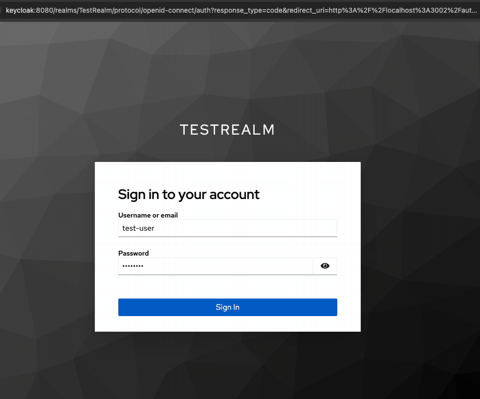

# passport-keycloak-strategy

A PureScript Passport Strategy for authenticating with [Keycloak](http://www.keycloak.com/) using the OAuth2/OIDC API.



This library wraps the [passport-keycloak-oauth2-oidc-portable](https://github.com/brakmic/passport-keycloak-oauth2-oidc-portable) npm package, providing a PureScript interface to its KeycloakStrategy. The underlying strategy is based on [passport-oauth2](http://www.passportjs.org/packages/passport-oauth2/) and supports both public and confidential clients, including full [PKCE](https://tools.ietf.org/html/rfc7636) (Proof Key for Code Exchange) support.

---

## Features

- **PureScript Integration:** Use Keycloak authentication in PureScript applications.
- **Public & Confidential Clients:** Supports both client types.
- **PKCE Support:** Ensures secure OAuth2 flows for public clients.
- **FFI with Node.js/Express:** Easily integrate with existing Express applications.
- **Interoperability:** Leverages the [passport-keycloak-oauth2-oidc-portable](https://github.com/brakmic/passport-keycloak-oauth2-oidc-portable) package.

---

## Installation

1. **Clone the Repository:**

   ```bash
   git clone https://github.com/brakmic/purescript-passport-keycloak-strategy.git
   cd purescript-passport-keycloak-strategy
   ```

2. **Install Dependencies:**

   ```bash
   npm install
   pnpm install  # if you use pnpm
   ```

3. **Build the Library:**

   ```bash
   spago install
   spago build
   ```

---

## File Structure

The repository is structured as follows:

```bash
.
├── keycloak-demo
│   ├── keycloak
│   │   ├── docker-compose.yaml
│   │   └── test-realm.json
│   ├── package.json
│   ├── spago.yaml
│   ├── src
│   │   ├── Config.purs
│   │   ├── Foreign
│   │   │   ├── Express.js
│   │   │   └── Express.purs
│   │   ├── Main.purs
│   │   ├── Server.js
│   │   └── Server.purs
│   ├── static
│   │   ├── css
│   │   ├── js
│   │   └── views
│   └── test
│       └── Test
├── package.json
├── spago.yaml
├── src
│   ├── Foreign
│   │   └── KeycloakStrategy
│   └── KeycloakStrategy
│       ├── EncodableForeign.purs
│       ├── KeycloakStrategy.purs
│       └── Types.purs
├── test
│   └── Main.purs
```

- **src/**: Contains the PureScript source code.
- **keycloak-demo/**: A test/demo client that demonstrates usage of the library.
- **docker-compose.yml & test-realm.json**: Used to run a local Keycloak server for testing.

---

## Usage

### Configuration

Configure your Keycloak realm and client accordingly. For a **public client**, ensure:
- `Access Type` is set to `public`.
- No client secret is required.
- PKCE is enabled.

```haskell
makeKeycloakOptions :: ServerConfig -> KeycloakStrategyOptions
makeKeycloakOptions config = KeycloakStrategyOptions
  { ksoRealm: config.realm
  , ksoAuthServerURL: config.authServerURL
  , ksoClientID: config.clientId
  , ksoCallbackURL: config.callbackURL
  , ksoPublicClient: Just true
  , ksoClientSecret: Nothing
  , ksoAuthorizationURL: Nothing
  , ksoTokenURL: Nothing
  , ksoSslRequired: Just "none"
  , ksoScope: Just "openid profile email"
  , ksoCustomHeaders: Nothing
  , ksoScopeSeparator: Just " "
  , ksoSessionKey: Nothing
  , ksoStore: Nothing
  , ksoState: Just true
  , ksoSkipUserProfile: Just false
  , ksoPkce: Just true
  , ksoProxy: Nothing
  }
```

For a **confidential client**, ensure:
- `Access Type` is set to `confidential`.
- A client secret is provided.

### Running the Demo

1. **Environment Setup:**  
   Create a `.env` file (using `.env.example` as a template) with the following settings:

   ```ini
   # Keycloak Demo Port
   PORT=3002
   # Keycloak Configuration
   KEYCLOAK_AUTH_SERVER_URL=http://keycloak:8080
   KEYCLOAK_REALM=TestRealm
   KEYCLOAK_CLIENT_ID=test-client
   KEYCLOAK_CALLBACK_URL=http://localhost:3002/auth/keycloak/callback
   # Development only
   NODE_TLS_REJECT_UNAUTHORIZED=0
   # CORS
   COOKIE_ORIGIN=http://localhost:3002
   # Session
   SESSION_DOMAIN=localhost
   SESSION_SECRET=a_very_secret_string
   ```

2. **Start Keycloak:**  
   From the repository root, run:

   ```bash
   cd keycloak-demo/keycloak
   docker compose up -d
   cd ../..
   ```

3. **Initial Build (Keycloak Strategy):**  
   
   ```bash
   spago install
   npm install
   spago build
   ```
4. **Initial Build (Keycloak Demo):**  
   
   ```bash
   cd keycloak-demo
   spago install
   npm install
   spago build
   ```

5. **Copy Environment Files:**

    ```bash
    npm run copy-env
    ```

6. **Run the Demo:**  
   The demo rebuilds everything and starts the server.

   ```bash
   spago run
   ```

   You should see output like:

   ```bash
   Server running on http://localhost:3002
   Visit http://localhost:3002/auth/keycloak-init to start authentication
   ```

7. **Test Authentication:**  
   Open [http://localhost:3002/auth/keycloak-init](http://localhost:3002/auth/keycloak-init) in your browser. Log in with the credentials (e.g., "test-user" / "password"). After authentication, you'll be redirected to the profile page. Use the provided logout button to end the session.

---

## Development

- **Building the Library:**

  ```bash
  spago build
  ```

- **Running Tests / Demo:**

  ```bash
  spago run
  ```

- **Keycloak for local testing:**  
  Use the provided `docker-compose.yml` and `test-realm.json` (located in `keycloak-demo/keycloak`) to spin up a local Keycloak server:

  ```bash
  docker compose up -d
  open http://localhost:8080
  enter user: "admin" - password: "admin"
  ```

- **Environment updates:**  
  If you update `.env`, run:

  ```bash
  npm run copy-env
  ```

---

## License

[MIT](./LICENSE)
